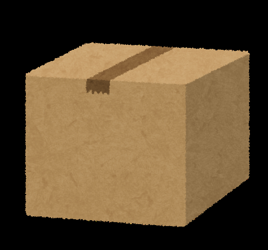
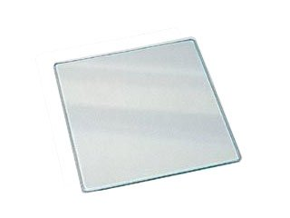
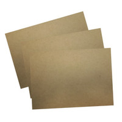
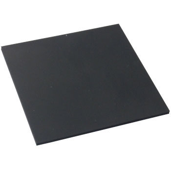
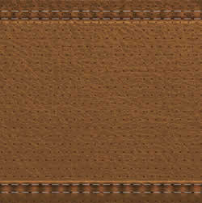

# Aizu Geek Dojo 講習 (レーザーカッター①)
 
## 目次

- 1.	レーザーカッターについて
- 2.	安全に操作するために
- 3.	操作方法
 
### 1. レーザーカッターについて

#### レーザーカッターとは
レーザーカッターは名前の通りレーザーを使い材料を切断、彫刻をする装置です。高出力のレーザーを当てることで材料を焼き切り切断したり、材料の表面を焦がして彫刻したりします。

#### AizuGeekDojoにあるレーザーカッター
Aizu Geek Dojoには２台のレーザーカッターがあります。
- Trotec Speedy 100
    最大加工寸法610x305mm
- Trotec Speedy 300
    最大加工寸法726x432mm

どちらもレーザーの出力は30Wで最大1cm程度のMDF(木板)やアクリル板を加工することができます。

#### 集塵脱臭装置
またレーザーカッターの隣にある機械は集塵脱臭装置です。レーザーカッターに合わせて自動で動くため、特別な操作は必要ありません。
内部にはフィルターや活性炭があり、加工で発生した煙や匂いを吸収し軽減します。フィルターや活性炭は定期的な交換が必要です。装置のディスプレイに目安の使用状況が表示されています。フィルターは50%を超えたら交換するようにしてください。

#### 加工できる素材
AizuGeekDojoにあるレーザーカッターでは主に以下の材料を加工することができます。

| 紙、ダンボール | アクリル板 | MDF | レーザー加工用スタンプゴム | 皮革 |
| :---------: | :-------:| :-----: | :--------------: | :-----: |
||||||

- 紙、段ボール
- アクリル板
- MDF
- レーザー加工用スタンプゴム
- 皮革

それ以外の材料は加工ができない、または加工時に有毒なガスが発生することがあるため使用しないでください。

#### レーザーカッターの危険性
レーザーカッターではレーザーポインターなど、普段使っているようなレーザーに比べ、非常に強力な出力のレーザーを使用しています。
そのため使用時には細心の注意と危険性の把握が必要です。必ず「2. 安全に操作するために」を参照してください。
 
### 2. 安全に操作するために

#### レーザーカッター使用時は
レーザー加工ではちょっとしたミスで火災につながります。
レーザー加工中は絶対に
- レーザーカッターから目を離さない
- 部屋を出ない

ようにしてください。
トイレ等止むを得ずに離れる場合は必ず一時停止をしてください。  
また、思わぬトラブルを防ぐために以下の点を心がけましょう。
- 今までに切ったり、彫刻したりしたことがある物を使う
- 普段使わない素材を使うときには細心の注意を払うこと

#### 材料をレーザーカッターにセットする時は
レーザーカッターに材料をセットする時が重要です。
セットするときは次の点に注意してください。
- 加工する素材は本当に加工しても良いものか
- 加工する素材の他に残っていないか
- 風で飛びそうなものはないか

塩化ビニルを加工しようとすると有害なガスが発生します。絶対に加工しないでください。

またアクリル板についている保護シートや紙を加工する際に風でめくれ上がり、レーザーに触れて発火することがあります。
保護シートをきちんと剥がすか飛ばないように処理したり、紙を加工する場合は飛ばないようにテープで固定したりするなど注意しながらセットしてください。

#### もしものときは
どんなに注意を払っていてもなんらかの原因で火が発生する恐れがあります。
作業中に万が一材料などに火がついた場合は慌てずに落ち着いて、
- すぐにレーザーカッターの蓋をあける
- それでも消えなければ消火器を使い消火する
- それでも消えない場合は水を使って消火する

ようにしてください。
小さな火であればレーザーカッターを止めれば消えることが大半です。それでも消えなければ消火器等を使用して消火してください。
