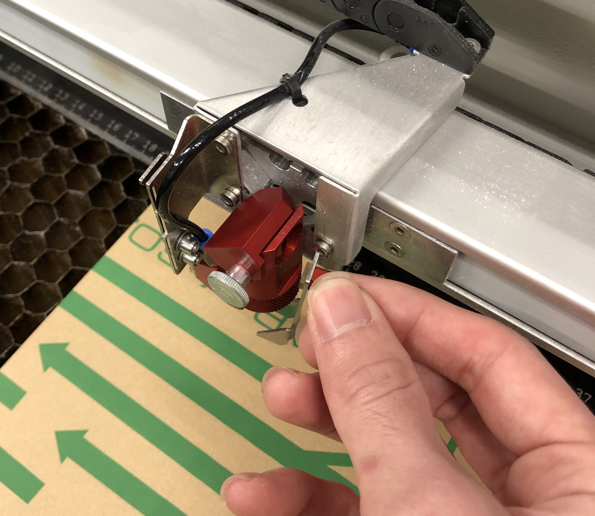
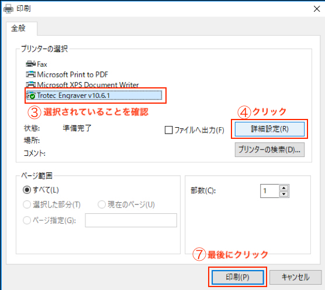
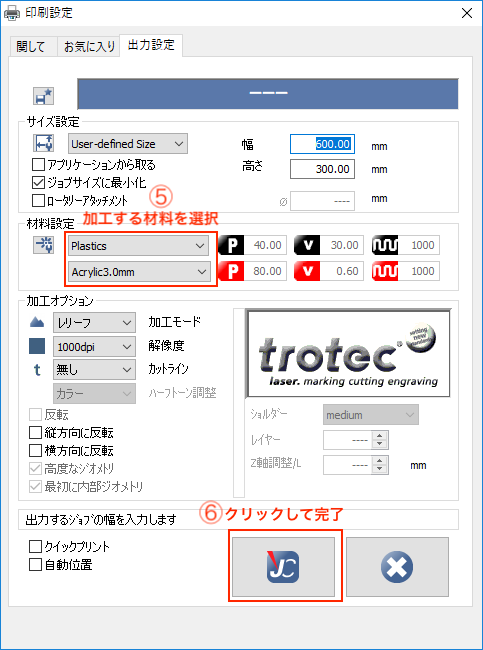
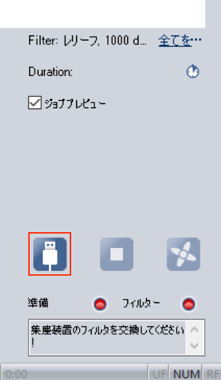

# 基本的な使い方

> 今回は基本的な使い方の説明をしていきます。  

## 目次

### レーザーカッターの使い方  
  

#### 使う際の流れ  

##### レーザーカッター  
- 電源を入れます  
レーザーカッターの後ろにある電源をつけます。  
- 初期化を待ちます  
1分ほどかかるときがあります。  
初期化が終わるとピーとビープ音がなります。  
- 材料を置きます  
材料を左端の角に合わせて設置します。
- 高さ合わせをします  
  
十字キーを使い、加工する近くにポインターを移動します。  
金具の金属部分をレーザー出力部の出っ張りに引っ掛け、上下スイッチで金具が倒れるギリギリまで材料を近づけます。  
事前に作業しやすいところにポインターを移動すると作業しやすいです。  
- 位置合わせをします  
十字キーを使い、切断開始場所に移動します。  
位置合わせをしたら蓋を閉じます。  
#### 覚えておくといいこと  
  
> 上の3つのボタンには、それぞれ集塵脱臭装置オンオフ、スリープモードのオンオフ、一時停止が割り当てられています。
- 加工中、加工直後は集塵脱臭装置がオンになり、その後しばらくするとオフになります。自動で制御されますが、ボタンを押すことで手動でオンオフすることもできます。
- スリープ中はレーザーの移動や高さの調整などはできません。操作するときはスリープを解除してください。

### パソコンでの操作  
> illusutaraterの使い方は別資料です。  

#### 使う際の流れ  
- データをillusutaraterで開く  
      
- オプションを設定し、印刷  
      
      
      
      

- JCでレーザーカッターと接続  
      
    上記の操作をするとJCというソフトが立ち上がります。  
    まず、レーザーカッターと、JCを接続しましょう  
    USBマークのボタンをクリックしてください。  
       
    すると接続ができ、十字マークが画面に出ます。  
    それが、レーザーの位置です。  

- データの配置  
    接続ができたら、データの配置をしましょう  
    右側の欄に、先ほどプリントをしたデータの名前が出ています。  
      
    JCの画面は、レーザーカッターの稼働面と同期されているので、それを印刷したい場所にドラッグ&ドロップで起きましょう。現在のレーザーの位置におくのが良いです。  
      

- スタート  
    印刷の準備が整いましたら、 蓋が閉まっていることを確認しスタートしましょう。  
      

- 加工後の作業  
    加工中に火が出たり、問題が発生した場合は蓋を開けてください。自動停止します。  
    加工が終了するとピーとビープ音がなります。音がなるまで蓋を開けないでください。  
    音がなったら蓋を開けてください。  
    彫刻をすると表面に粉がついていることがあります。その際はキムワイプで表面を拭いてください。  
    そのときは集塵脱臭装置がオンになっている状態で奥に向かって払うようにするといいです。  
    その後レーザーカッターから加工物を取り出してください。  

- レーザーカッターの使用後  
    レーザーカッターの使用が終わったらまずはPC側でJCを終了しておきます。  
    次にテーブルを一番下まで下げ、レーザーを元の位置に戻して電源を切ってください。  
    その後テーブルのハニカムボードを外し、下に落ちている加工した際に発生した破片などを掃除します。大きい破片は手で取り、小さなものは掃除機などで掃除してください。  
    その後テーブルを戻し、蓋を閉めて終わりです。

#### 覚えておくといいこと  
> データを右クリックすると下のようなメニューが表示されます。  
> 便利な機能もあるので覚えておくといいでしょう。

- ジョブの再起動  
    一度加工したデータは加工終了のフラグがつき再度加工されません。ジョブの再起動をすることでフラグを解除し再度加工することができます。
- ジョブの方向を変える  
    右クリックすると回転を選択できます。  
    イラストレーターでも回転できますが、ここでもできます。  
- ジョブのコピー  
    データを複製します。同じものを複数作成するときに便利です。

> また上の方にあるメニューバーにも便利な機能があります。
- プレビュー  
    右上の目のマークを押すと、プレビューができます。  

## 終わりに
詳しい使い方は、Trotecの公式ページに書いてあります。   
みると良いでしょう   
[公式ページ使い方](https://www.troteclaser.com/ja/knowledge/tips-for-laser-users/laser-from-adobe-illustrator/)  
