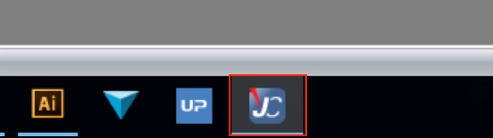

# 基本的な使い方

> 今回は基本的な使い方の説明をしていきます。

## 目次

### レーザーカッターの使い方

#### 使う際の流れ

##### レーザーカッター
- 電源を入れます  
    レーザーカッターの後ろにある電源をつけます。
- 初期化を待ちます  
    1分ほどかかるときがあります。
- 材料を置きます  
    材料を左端の過度に合わせて設置します。
- 高さ合わせをします。  
    
    金具の金属部分をレーザー出力部の出っ張りに引っ掛け、上下スイッチでで金具が倒れるギリギリまで材料を近づけます。
- 位置合わせをします。  
    十字キーを使い、切断開始場所に移動します。

#### 覚えておくといいこと  
  
> 上のボタンには、ファン起動、ファン停止、一時停止が割り当てられています。

### パソコンでの操作  
> illusutaraterの使い方は別資料です。

#### 使う際の流れ  
- データをillusutaraterで開く  
      
- オプションを設定し、印刷  
      
      
      

- JCでレーザーカッターと接続  
      
    上記の操作をするとJCというソフトが立ち上がります。
    まず、レーザーカッターと、JCを接続しましょう
    USBマークのボタンをクリックしてください。
      
    すると接続ができ、十字マークが画面に出ます。
    それが、レーザーの位置です。

- データの配置  
    接続ができたら、データの配置をしましょう
    右側の欄に、先ほどプリントをしたデータの名前が出ています。
      
    JCの画面は、レーザーカッターの面と同期されているので、それを印刷したい場所にドラッグ&ドロップで起きましょう。レーザーの位置におくのが良いです。
      

- スタート  
    印刷の準備が整いましたら、 スタートしましょう
      

#### 覚えておくといいこと
- 回転  
    右クリックすると回転を選択できます。
    イラストレーターでも回転できますが、ここでもできます。
- 複製  

- プレビュー  
    右上の目のマークを押すと、プレビューができます。

## 終わりに
詳しい使い方は、Trotecの公式ページに書いてあります。  
みると良いでしょう  
[公式ページ使い方](https://www.troteclaser.com/ja/knowledge/tips-for-laser-users/laser-from-adobe-illustrator/)