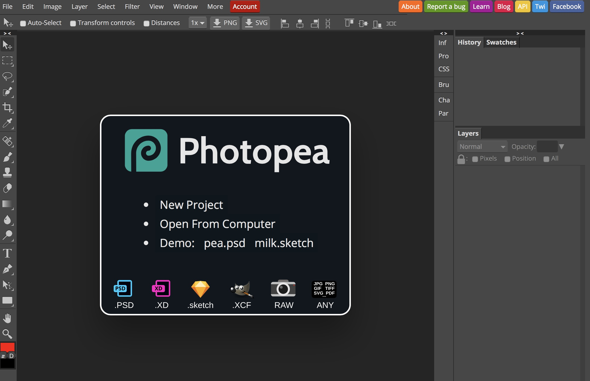

# Aizu Geek Dojo 講習 (レーザーカッター①)
 
## 目次

- 1.	Photopiaについて
- 2.	SVGとは
- 3.	Illustratorでの操作

### 1. フォトピアについて

#### フォトピアとは
様々なフォーマットをサポートしたオンラインのエディタです。  
    
>https://www.photopea.com  

詳しい使用方法は調べてみてください。

#### フォトピアでの操作  
フォトピアはAI(Adobe Illustrator)チックなエディタです。ですが、線の太さを0.1ptより細くすることができません。レーザーカッターは0.001mmの赤い線を切るという操作を行うため、ここで作られたファイルのみでは切る工程まで行うファイルを作成することはできません。そのため、一度作ったファイルをSVG 形式でエクスポートし、AIでそのSVGファイルをインポートし、編集する必要があります。  
SVG形式での注意点なのですが、例えば画像をインポートしたスケッチファイルをSVGエクスポートしても、画像情報は含みません。あくまでSVG形式は線と塗りで構成された図のファイルと考えてください。フォトピアのカスタムシェイプ、短形などのツールで作られたスケッチファイルをエクスポートする前提です。  

  

 ### 2.   SVGとは
 二次元ベクタ形式の画像形式です。ベクタ形式のため、シェイプ、パス、テキスト、フィルター効果を使用して画像描写を行なっています。  
 SVG形式でAIにインポートすることで、白黒の図がAIで操作可能となります。AIは特殊で、SVG形式に色情報を含まないようです。
 > [Adobe SVGについて](https://helpx.adobe.com/jp/illustrator/using/svg.html)

 ### 3. Illustratorでの操作  
 保存したSVGファイルをドラッグ&ドロップ等でAIで開いてください。AIでのSVG形式は自動的に塗りが黒となります。  

   

 SVGファイルのビュワーとなります。そのため、図全体を選択し、コピーした後、新たにAI形式のファイルを開き、そちらにコピー＆ペーストしてください。画像のように各辺の編集ができます。彫刻部分と切断部分を考え、図を編集してください。  
 ここからは今までと同様です。レーザーカッターで切断処理を行いたい線を選択し、0.001mmの赤い線に変更します。

   

補足ですが、上の画像を印刷すると、線全てを切断処理するためバラバラのパーツが印刷されます。またAIではひとつずつのシェイプを操作できますが、カスタムシェイプの場合、カスタムシェイプを一つのシェイプとして操作されます。そのため上画像はPCのシェイプの一つの線だけの太さを変える等の操作はできません。これはPhotopiaの段階でも同様です。カスタムシェイプで切断処理をする場合は注意が必要です。  
 以上でフォトピアを用いた加工ファイルの作成方法のインストラクションを終わります。
