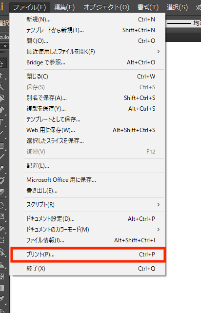
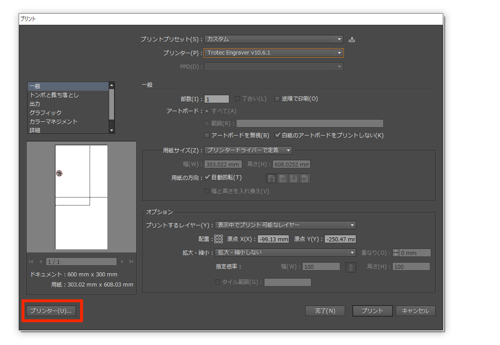
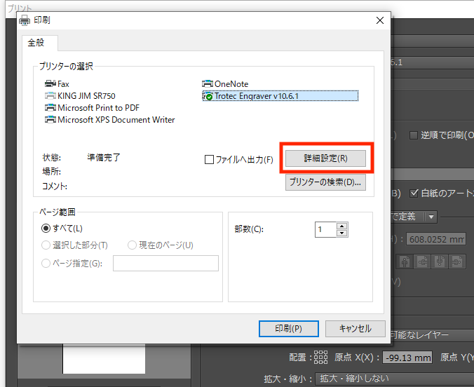
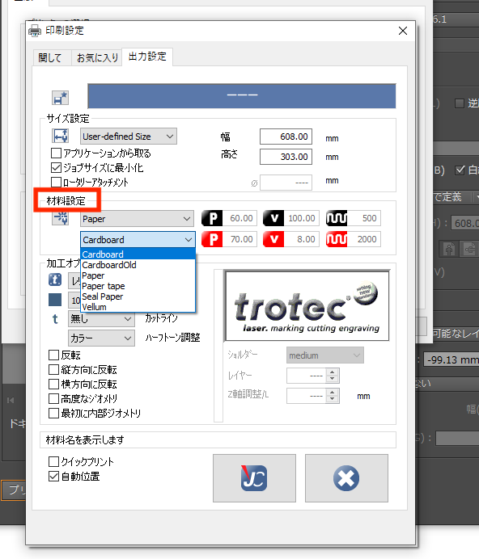
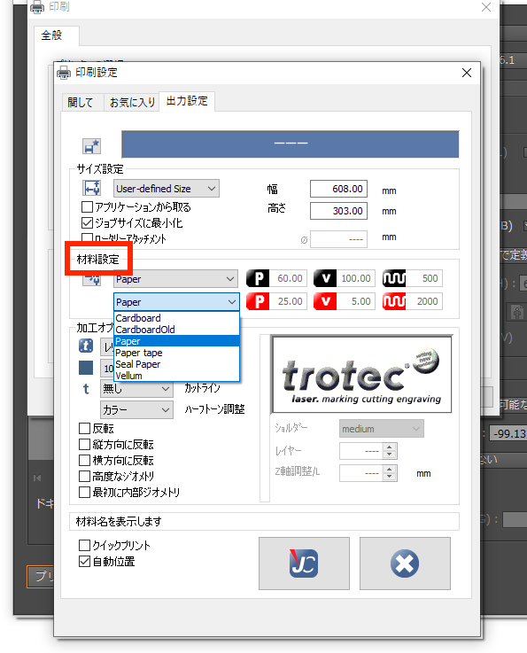
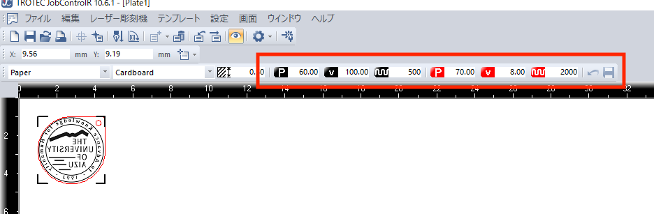

# 紙を切るときの設定、注意事項等

>2019年7月31日に行われた紙カットテストの成功例を基に設定、注意事項をまとめていく。

## 目次

 1. レーザーカッターの種類
 2. 用紙の種類
 3. 出力設定
 4. 用紙の設定等作業条件
 5. 利用者とSA体制
 6. レーザーカッターの連続利用設定とインターバル時間

### 1. レーザーカッターの種類
- speedy300、speedy100
- speedy300使用時は、speedy100で設定する速度を1/2にして使用する。

### 2. 用紙の種類、条件
　以下の種類、条件を満たす用紙を使用すること。
- 100均の厚紙(A4用8枚入り,0.5mm)
- コクヨの厚紙 : 厚さ0.23mm
- [trotec商材 ](https://www.troteclaser.com/ja/knowledge/laser-parameters-for-high-quality-engraving-results/)  
- ミューズKMKケント紙 #250 : 厚さ0.29mm（2020/12/9の検証でのみ利用）
- 紙の大きさ : 最大 A4
- 紙の厚さ : 0.23 ~ 0.5mm 

### 3. 出力設定,手順

#### 1. illusutaraterから ファイル -> プリント を選択。
 
#### 2. プリンター(U)をクリック。
 
#### 3. 詳細設定(R)をクリック。
 
#### 4. 材料設定で材料を決定する。
100均の厚紙の場合：Paper -> Cardboard  
  
それ以外の厚さ0.23 ~ 0.5mmの紙の場合：Paper -> Paper  
 

以降の手順は他と同様。

#### JC (Job Controller) での設定
 
画像の赤枠で囲った部分に注目。
Pはパワー、vは速さを表す。また、黒色と赤色で2種類のPとvがあるが、黒色が彫刻を赤色がカットの設定を表している。カットのvは8がデフォルトである。(Ppaer -> Cardboard選択時。)切れが悪いときは数字を7まで少しずつ下げる。  
また、Speedy300の速さはSpeedy100の約２倍である。このことから、Speedy100の速さ/2をSpeedy300の速さに設定することで、Speedy100でしか検証していない用紙もSpeedy300での利用が可能だと思われる。  
例）Speedy100 : v=8の場合は、Speedy300 : v=4と設定する。  

### 4. 用紙の設定等作業条件
- 1枚ずつカットする。(複数枚を重ねてカットしないこと。)
- カット中に端切れが吹き飛ばないデザインかどうか。
- カット線とカット線の距離が0.5mm以上であること。

### 5. 利用者とSA体制
- 必ず利用者1名に対し、SAを1名配置。
- SAは消火器を手元に準備しておく。
- 消火器の使い方の把握。
- SAの許可なく出力設定を変更することを禁止する。

### 6. レーザーカッターの連続使用時間とインターバル時間
- 連続使用時間 : 10分
- インターバル時間 : 5分
